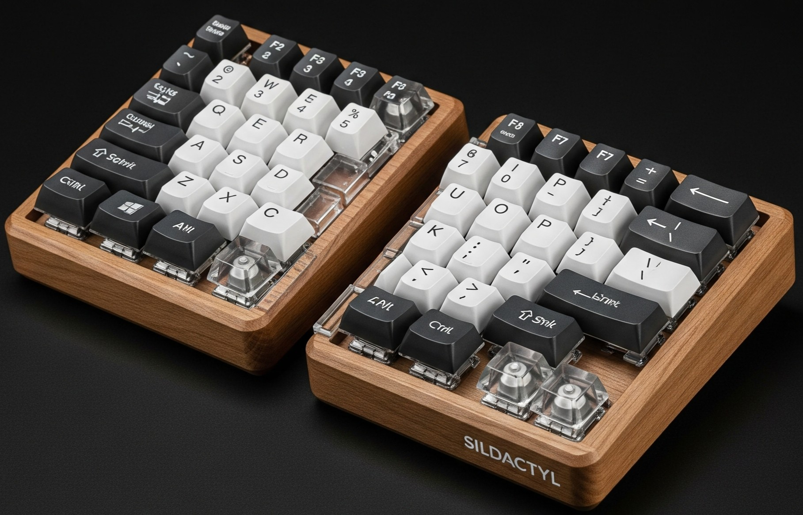

o# Sildactyl
follow ordering and soldering sections from Ortholinear build. Additionally you will need to order this
- 1x 4x4 akko with 16 switches (5$) https://a.aliexpress.com/_EQE2sG2 . This is the same one as in macropad build (you can reuse that one)
  
In total you need:
- two 4x6 bases
- one 4x4 or two 2x4 or one 4x6
- for thumb cluster: one 3x3 or two 1x3

# Tools
- something to cut acrylic
- double sided tape (not a very strong tape)

# Case assembly
## Cutting acrylic bases
For one side you need:
- 2x4 for pinky finger ( e.g from half of the akko 4x4 tester )
- 2x4 for index finger
- 1x4 for ring finger
- 1x4 for middle finger

That is why you should cut each 4x6 like below:

There are YouTube videos that explain how to cut acrylic.
I've cutted the bases using driller and regular drills for metal. It was not easy but doable. I didn't have any electric saw available.

## Layout testing
Mount the switches and keycaps. Mount the pieces togeter with double sided tape and test if they match your hands. Experiment iwth different shapes and layouts. Some ideas are below. Notice how I am moving the pieces on top of each other, more to the front or to the back or bending them inward.

## Gluing and building case
Glue the pieces together. I used hot glue as it lets you reposition the pieces if you are not happy with the result. After some time of testing you can remove the hot glue and replace it with a stronger alternative.

Mount the hotswap switches using tweezers, pliers or just your fingers:

Build the case. I used some random plastic pieces/containers to keep it tented.

Glue the wire connectors to the case, so that you do not pull the wires that are soldered to MCU directly.

# Next steps
## Test for a month or two
keep uisng the keyboard for 1-2 months and see if it is comfortable.

## Nicer case
consider building a case from wood, plastic box or whatever works for you.

Some ai inspiration:

## Different case size
consider other shapes like
- a box where the acrylic shape goes inside (like in kinesis advantage)

## Different layout 
It will require changing qmk firmware and recompiling that.
- bigger/smaller thumb cluster
- different number of rows/columns

## Column bending
Consider buing another set of keycaps with different profile. The highest buttons should go to the top row and bottom row. The lower buttons to the middle. This way it will simulate as if the columns are bent inward (the top row should be easier to reach)
